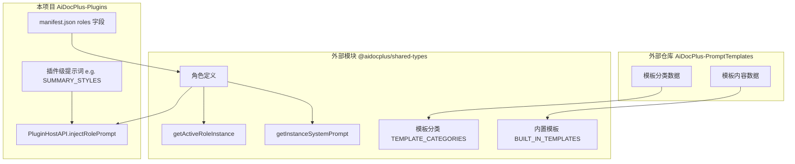

## 产品概述

深入研究 AiDocPlus 插件项目的提示词模板管理系统架构，并制定完善"法院工作"分类的技术方案。

## 核心功能

### 已发现的系统架构

**1. 提示词模板管理系统（双层架构）**

- **全局提示词模板系统**：定义在外部模块 `@aidocplus/shared-types`
- `BUILT_IN_TEMPLATES`：内置模板列表
- `TEMPLATE_CATEGORIES`：模板分类定义（类型为 `Record<string, TemplateCategoryInfo>`）
- 数据来源：外部仓库 `AiDocPlus-PromptTemplates`（通过 generated 文件导入）

- **插件级提示词系统**：每个插件内部定义
- 如 `plugins/summary/SummaryPluginPanel.tsx` 中的 `SUMMARY_STYLES`
- 使用 `PluginPromptBuilderDialog` 构建提示词界面
- 使用 `PluginPanelLayout` 管理提示词输入和预览

**2. 角色系统**

- **定义位置**：外部模块 `@aidocplus/shared-types`
- `getActiveRoleInstance(roleSettings)` - 获取当前激活的角色实例
- `getInstanceSystemPrompt(instance)` - 获取角色的系统提示词

- **插件关联方式**：通过 `manifest.json` 中的 `roles` 数组

```
"roles": ["lawyer", "civil-servant"]
```

- **自动注入机制**：`plugins/_framework/PluginHostAPI.ts` 中的 `injectRolePrompt()` 函数
- AI 调用时自动将角色系统提示词注入到消息中

**3. 已发现的法院相关角色和插件**

| 角色 | 使用该角色的插件 |
| --- | --- |
| `lawyer`（律师） | summary, email, encrypt, watermark, diff, translation, review |
| `civil-servant`（公务员） | summary, table, email, timeline, encrypt, watermark, officeviewer |


**4. "法院工作"分类现状**

- 无独立的"法院工作"分类
- 提示词模板分类（`TEMPLATE_CATEGORIES`）定义在外部仓库
- 角色定义在外部模块 `@aidocplus/shared-types`

### 完善"法院工作"分类的技术方案

需要跨两个项目协作：

1. **外部模块 `@aidocplus/shared-types`**（主程序仓库）

- 添加法院角色定义（`judge`、`court-clerk`、`court-secretary` 等）
- 创建"法院工作"模板分类（`court-work`）
- 定义法院相关提示词模板

2. **本项目 `AiDocPlus-Plugins`**

- 更新插件 `manifest.json` 的 `roles` 字段
- 添加法院专用提示词模板

## 技术架构分析

### 系统架构图



### 核心代码位置

| 模块 | 文件路径 | 作用 |
| --- | --- | --- |
| 类型定义 | `stubs/shared-types/src/index.d.ts` | PromptTemplate、TemplateCategoryInfo 类型 |
| 角色注入 | `plugins/_framework/PluginHostAPI.ts` | injectRolePrompt() 函数 |
| 提示词构建 | `sdk/_framework/PluginPromptBuilderDialog.tsx` | 提示词构建弹窗组件 |
| 面板布局 | `sdk/_framework/PluginPanelLayout.tsx` | 提示词管理和预览 |
| 插件分类 | `sdk/constants.ts` | 插件分类定义 |


### 完善"法院工作"分类的实现路径

#### 1. 外部模块改动（主程序仓库）

**位置**：`@aidocplus/shared-types` 模块

```typescript
// 新增法院角色定义
export interface RoleDefinition {
  id: string;
  name: string;
  systemPrompt: string;
  category?: string;
}

// 建议添加的法院角色
const COURT_ROLES: RoleDefinition[] = [
  { id: 'judge', name: '法官', systemPrompt: '...', category: 'court' },
  { id: 'court-clerk', name: '书记员', systemPrompt: '...', category: 'court' },
  { id: 'court-secretary', name: '法院文秘', systemPrompt: '...', category: 'court' },
];

// 新增模板分类
export const TEMPLATE_CATEGORIES: Record<string, TemplateCategoryInfo> = {
  // ... 现有分类
  'court-work': { name: '法院工作', icon: 'Scale', isBuiltIn: true },
};
```

#### 2. 本项目改动

**更新插件 manifest.json**：

```
// plugins/summary/manifest.json
{
  "roles": ["student", "researcher", "lawyer", "judge", "court-clerk"]
}
```

**添加法院专用提示词模板**：

```typescript
// 在插件内部添加法院风格
const COURT_SUMMARY_STYLES = [
  { 
    key: 'court-judgment', 
    label: '裁判文书摘要', 
    prompt: '根据本文档内容，提炼裁判文书的核心要点...' 
  },
  { 
    key: 'court-meeting', 
    label: '会议纪要摘要', 
    prompt: '根据本文档内容，生成法院会议纪要摘要...' 
  },
];
```

### 数据流向

```
用户选择角色 → useSettingsStore.role → getActiveRoleInstance()
                                           ↓
插件调用 AI ← injectRolePrompt() ← getInstanceSystemPrompt()
     ↓
AI 响应（带角色上下文）
```

### 关键接口

```typescript
// 提示词模板接口
interface PromptTemplate {
  id: string;
  name: string;
  category: PromptTemplateCategory;  // 分类 key
  content: string;                   // 提示词内容
  variables?: string[];              // 变量列表
  isBuiltIn: boolean;
  description?: string;
}

// 分类信息接口
interface TemplateCategoryInfo {
  name: string;      // 显示名称
  icon: string;      // Lucide 图标名称
  isBuiltIn?: boolean;
}
```